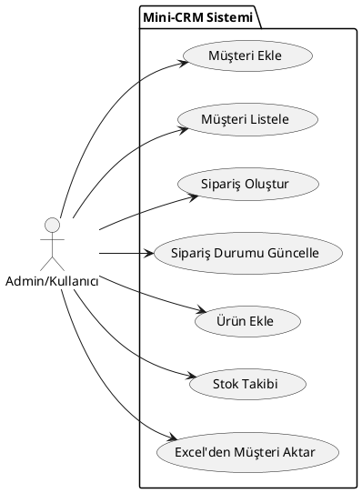
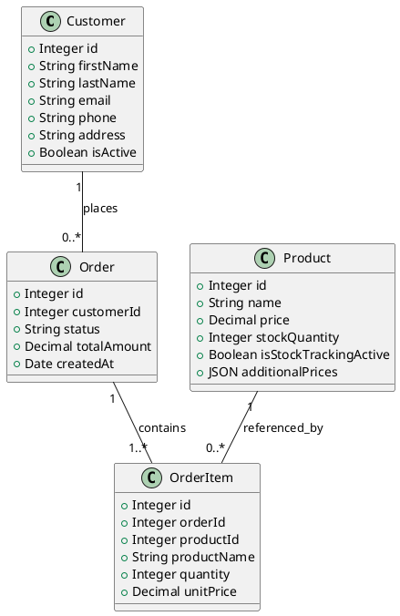
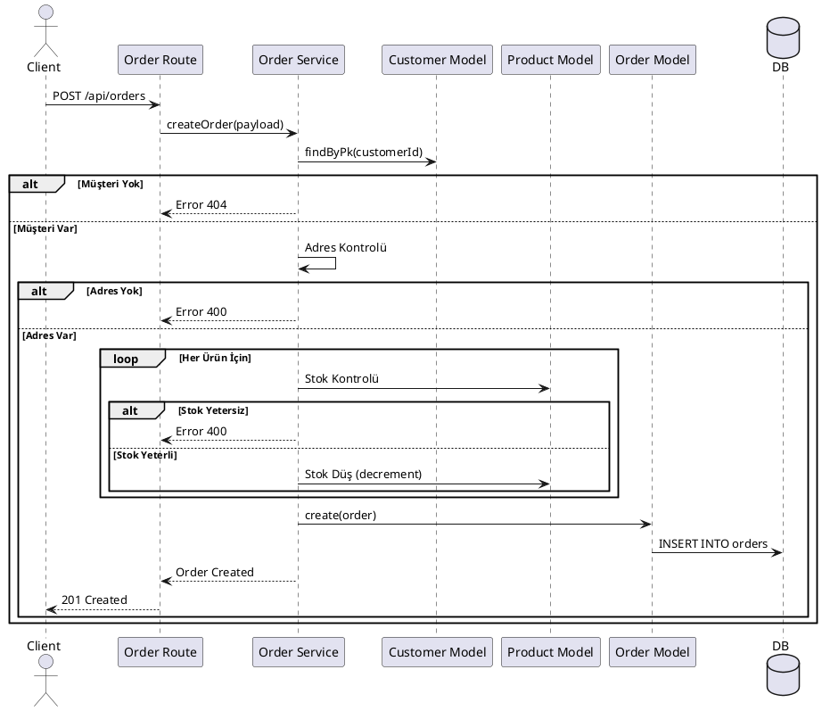

# 🏗️ Mimari Dokümantasyon

## Genel Bakış

Mini-CRM, layered (katmanlı) mimari yaklaşımı ile geliştirilmiş bir REST API'dir.

## Katmanlar

### 1. Routes (Routing Katmanı)
- **Görev:** HTTP isteklerini karşılar, route tanımları
- **Dosyalar:** `src/routes/*.js`
- **Sorumluluklar:**
  - HTTP endpoint tanımları
  - Validation middleware çağrısı
  - Service katmanına yönlendirme
  - HTTP response oluşturma

### 2. Middlewares (Ara Katman)
- **Görev:** İstek/yanıt işleme, doğrulama, loglama
- **Dosyalar:** `src/middlewares/*.js`
- **Bileşenler:**
  - `traceId.js`: Her istek için benzersiz ID
  - `requestLogger.js`: Request/response loglama
  - `*Validation.js`: Veri doğrulama

### 3. Services (İş Mantığı Katmanı)
- **Görev:** İş kuralları ve logic
- **Dosyalar:** `src/services/*.js`
- **Sorumluluklar:**
  - CRUD operasyonları
  - İş kuralları uygulaması
  - Model katmanı ile etkileşim
  - Hata yönetimi

### 4. Models (Veri Katmanı)
- **Görev:** Veritabanı şeması ve ORM
- **Dosyalar:** `src/models/*.js`
- **Sorumluluklar:**
  - Sequelize model tanımları
  - İlişki tanımları
  - Veri validasyonu

### 5. Utils (Yardımcı Fonksiyonlar)
- **Görev:** Tekrar kullanılabilir fonksiyonlar
- **Dosyalar:** `src/utils/*.js`
- **Örnekler:**
  - Veri temizleme
  - Formatting
  - Helper functions

## Veri Akışı

```
Client Request
     ↓
Middleware (traceId, requestLogger)
     ↓
Routes (HTTP handler)
     ↓
Middleware (validation)
     ↓
Services (business logic)
     ↓
Models (database operations)
     ↓
Database (PostgreSQL)
     ↓
Response
```

## UML Diyagramları

### 1. Use Case Diyagramı (Metin Bazlı)



### 2. Class Diyagramı (Özet)



### 3. Sequence Diyagramı (Sipariş Oluşturma)



## API Uçları Listesi

| Method | Endpoint | Açıklama |
|--------|----------|----------|
| GET | `/api/customers` | Müşterileri listele |
| POST | `/api/customers` | Yeni müşteri oluştur |
| GET | `/api/customers/:id` | Müşteri detayı |
| PUT | `/api/customers/:id` | Müşteri güncelle |
| DELETE | `/api/customers/:id` | Müşteri sil (soft delete) |
| GET | `/api/orders` | Siparişleri listele |
| POST | `/api/orders` | Sipariş oluştur |
| GET | `/api/orders/:id` | Sipariş detayı |
| PUT | `/api/orders/:id` | Sipariş durumu güncelle |
| GET | `/api/products` | Ürünleri listele |
| POST | `/api/products` | Ürün oluştur |

## Logging, Konfigürasyon ve Migration

### Logging Yapısı
- **Kütüphane:** Winston
- **Özellikler:**
  - `traceId`: Her isteği takip etmek için benzersiz ID.
  - `DailyRotateFile`: Loglar günlük dosyalanır ve 14 gün saklanır.
  - `requestLogger`: HTTP isteklerinin süresini ve durumunu otomatik loglar.

### Konfigürasyon
- **Yöntem:** Environment Variables (.env)
- **Yapı:** `src/config/index.js` üzerinden ortam (dev/test/prod) bazlı ayarlar yüklenir.
- **Güvenlik:** Şifreler kodda değil, ortam değişkenlerinde saklanır.

### Migration Stratejisi
- **Araç:** Sequelize CLI
- **Yaklaşım:**
  - Tablo oluşturma (`createTable`)
  - Kolon ekleme (`addColumn`) - Mevcut veriyi korumak için.
  - İndeks ekleme (`addIndex`) - Performans için.
- **Versiyonlama:** Timestamp tabanlı dosya isimleri ile sıralı çalışma garantisi.

## Database Şeması

### Customers Table
```sql
customers (
  id SERIAL PRIMARY KEY,
  first_name VARCHAR(50) NOT NULL,
  last_name VARCHAR(50),
  phone VARCHAR(20),
  email VARCHAR(100),
  address TEXT,
  is_active BOOLEAN DEFAULT true,
  created_at TIMESTAMP,
  updated_at TIMESTAMP
)
```

### Orders Table
```sql
orders (
  id SERIAL PRIMARY KEY,
  customer_id INTEGER REFERENCES customers(id) ON DELETE CASCADE,
  status VARCHAR(20) NOT NULL DEFAULT 'pending',
  total_amount DECIMAL(10,2),
  created_at TIMESTAMP,
  updated_at TIMESTAMP
)
```

## API Tasarım Prensipleri

1. **RESTful:** Resource-based URL'ler
2. **Validation:** Her input doğrulanır
3. **Error Handling:** Standart error format
4. **Logging:** Her istek loglanır
5. **Trace ID:** Request tracking

## Güvenlik

- Input validation
- SQL injection koruması (Sequelize ORM)
- Error handling (stack trace production'da gizli)
- Environment variables

## Performans

- Database indexing
- Connection pooling
- Log rotation
- Pagination desteği (limit)

## Gelecek İyileştirmeler

- [ ] Authentication/Authorization (JWT)
- [ ] Rate limiting
- [ ] Caching (Redis)
- [ ] Pagination iyileştirme
- [ ] WebSocket desteği
- [ ] Email notification