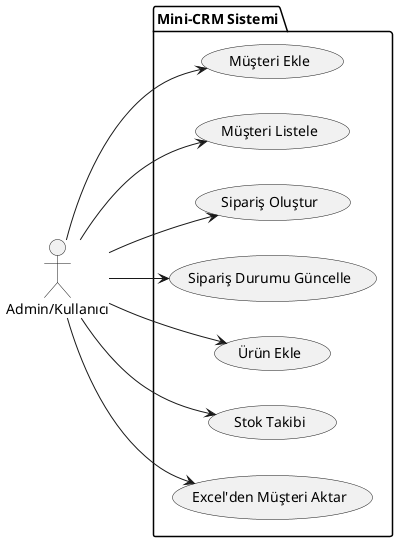
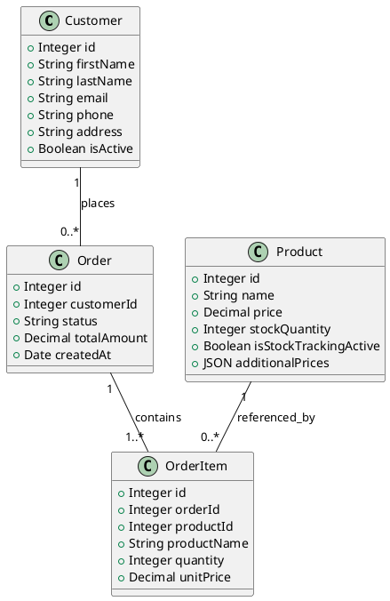
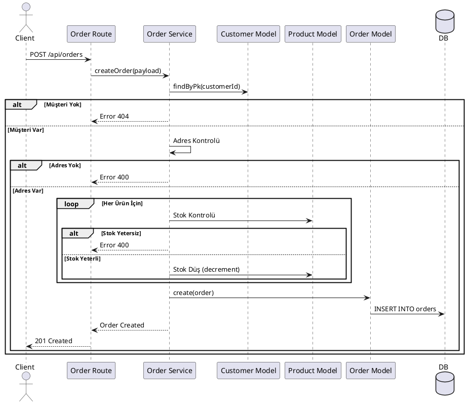

# Mimari Tasarım Dokümanı

## 1. Veritabanı Şeması

Projenin veritabanı şeması aşağıdaki gibidir:

### Customers Table
`customers`
- `id` (PK, Serial)
- `first_name` (NOT NULL)
- `last_name`
- `email` (Unique)
- `phone`
- `address`
- `is_active` (Default: true)
- `created_at`, `updated_at`

### Products Table
`products`
- `id` (PK, Serial)
- `name` (NOT NULL)
- `price` (Decimal(10,2))
- `stock_quantity` (Int, Default: 0)
- `is_stock_tracking_active` (Boolean, Default: true)
- `additional_prices` (JSON)
- `is_active` (Default: true)

### Orders Table
`orders`
- `id` (PK, Serial)
- `customer_id` (FK -> customers.id)
- `status` (Enum: pending, processing, shipped, delivered, cancelled)
- `total_amount` (Decimal)
- `created_at`, `updated_at`

### Order Items Table
`order_items`
- `id` (PK, Serial)
- `order_id` (FK -> orders.id)
- `product_id` (FK -> products.id, Nullable)
- `product_name` (String) - Anlık görüntüsü
- `quantity` (Int)
- `unit_price` (Decimal)
- `subtotal` (Decimal)

---

## 2. Modüller ve Servisler

### 1. Routes (Routing Katmanı)
- **Görev:** HTTP isteklerini karşılar, route tanımları
- **Dosyalar:** `src/routes/*.js`
- **Sorumluluklar:**
  - HTTP endpoint tanımları
  - Validation middleware çağrısı
  - Service katmanına yönlendirme
  - HTTP response oluşturma

### 2. Middlewares (Ara Katman)
- **Görev:** İstek/yanıt işleme, doğrulama, loglama
- **Dosyalar:** `src/middlewares/*.js`
- **Bileşenler:**
  - `traceId.js`: Her istek için benzersiz ID
  - `requestLogger.js`: Request/response loglama
  - `*Validation.js`: Veri doğrulama

### 3. Services (İş Mantığı Katmanı)
- **Görev:** İş kuralları ve logic
- **Dosyalar:** `src/services/*.js`
- **Sorumluluklar:**
  - CRUD operasyonları
  - İş kuralları uygulaması
  - Model katmanı ile etkileşim
  - Hata yönetimi

### 4. Models (Veri Katmanı)
- **Görev:** Veritabanı şeması ve ORM
- **Dosyalar:** `src/models/*.js`
- **Sorumluluklar:**
  - Sequelize model tanımları
  - İlişki tanımları
  - Veri validasyonu

---

## 3. UML Diyagramları

### 1. Use Case Diyagramı

**

**PlantUML Kodu:**

### 2. Class Diyagramı

**

**PlantUML Kodu:**

### 3. Sequence Diyagramı (Sipariş Oluşturma)

**

**PlantUML Kodu:**

---

## 4. API Uçları Listesi

| Method | Endpoint | Açıklama |
|--------|----------|----------|
| GET | `/api/customers` | Müşterileri listele |
| POST | `/api/customers` | Yeni müşteri oluştur |
| GET | `/api/customers/:id` | Müşteri detayı |
| PUT | `/api/customers/:id` | Müşteri güncelle |
| DELETE | `/api/customers/:id` | Müşteri sil (soft delete) |
| GET | `/api/orders` | Siparişleri listele |
| POST | `/api/orders` | Sipariş oluştur |
| GET | `/api/orders/:id` | Sipariş detayı |
| PUT | `/api/orders/:id` | Sipariş durumu güncelle |
| GET | `/api/products` | Ürünleri listele |
| POST | `/api/products` | Ürün oluştur |

---

## 5. Logging, Konfigürasyon ve Migration

### Logging Yapısı
- **Kütüphane:** Winston
- **Özellikler:**
  - `traceId`: Her isteği takip etmek için benzersiz ID.
  - `DailyRotateFile`: Loglar günlük dosyalanır ve 14 gün saklanır.
  - `requestLogger`: HTTP isteklerinin süresini ve durumunu otomatik loglar.

### Konfigürasyon
- **Yöntem:** Environment Variables (.env)
- **Yapı:** `src/config/index.js` üzerinden ortam (dev/test/prod) bazlı ayarlar yüklenir.
- **Güvenlik:** Şifreler kodda değil, ortam değişkenlerinde saklanır.

### Migration Stratejisi
- **Araç:** Sequelize CLI
- **Yaklaşım:**
  - Tablo oluşturma (`createTable`)
  - Kolon ekleme (`addColumn`) - Mevcut veriyi korumak için.
  - İndeks ekleme (`addIndex`) - Performans için.
- **Versiyonlama:** Timestamp tabanlı dosya isimleri ile sıralı çalışma garantisi.
